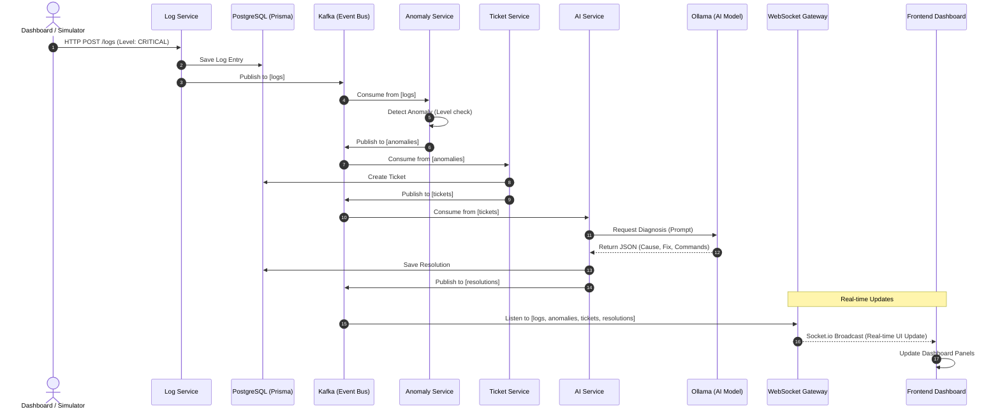

# AI Log Analyzer: System Architecture

This document explains the event-driven lifecycle of a log message as it moves through the microservices pipeline.

## 1. Sequence Diagram

## 2. Component Breakdown

### **Event Backbone** (Kafka)
The central nervous system of the project. Every microservice is decoupled; they only care about specific topics they subscribe to.

### **Intelligence Layer** (Ollama + AI Service)
The **AI Service** is the "brain." It doesn't just store data; it interprets the "CRITICAL" message, correlates it with the service name, and uses the `qwen2.5` model to generate actionable SRE commands.

### **Real-time Layer** (WebSocket Gateway)
Ensures that the user doesn't have to refresh. It bridges the backend Kafka events directly to the browser's `Socket.io` client.

### **Data Persistence** (PostgreSQL)
Prisma ORM handles all database interactions. Every state (Log -> Anomaly -> Ticket -> Resolution) is permanently recorded for audit and historical analysis.
